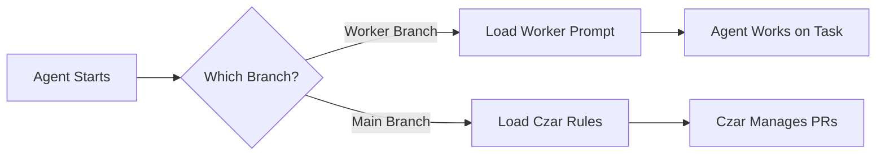

# Branch-Based Worker Loading

## Overview

Czarina uses **git branches** to automatically load the correct worker prompt for each agent. This approach works across **all AI coding assistants** (Claude Code, Cursor, Aider, Copilot, etc.) and requires minimal setup.

## How It Works



### The Flow

1. **Project Setup**: Run `czarina init-branches` to create all worker branches
2. **Worker Starts**: Agent checks out their assigned branch (e.g., `feat/v0.1.0-backend-attention-service`)
3. **Auto-Detection**: SessionStart hook detects the branch and loads the matching worker prompt
4. **Agent Works**: Agent receives their specific instructions and gets to work
5. **PR Creation**: When done, worker creates PR from their branch to main
6. **Czar Review**: Czar (on main branch) reviews and merges PRs

## Benefits

### ✅ Universal Compatibility
- Works with **any AI coding assistant** (not just Claude Code)
- No special configuration per agent
- Same workflow for all tools

### ✅ Automatic Role Assignment
- No manual "You are worker X" prompts needed
- Branch = Identity
- Can't accidentally work on wrong task

### ✅ Clean Git History
- Each worker's commits isolated to their branch
- Easy to review changes
- Simple to revert if needed

### ✅ Prevents Conflicts
- Workers can't accidentally load each other's prompts
- Czar rules only load on main branch
- Clear separation of concerns

## Setup

### 1. Initialize Branches

After running `czarina embed` to create orchestration:

```bash
# From czarina directory
./czarina-core/init-embedded-branches.sh /path/to/project

# Example
./czarina-core/init-embedded-branches.sh ../thesymposium
```

This will:
- Read `.czarina/config.json`
- Create a branch for each worker
- Push branches to remote (if exists)

### 2. Configure SessionStart Hook

The `embed` command should have already created `.czarina/load-worker-by-branch.sh`.

If not, copy it:

```bash
cp czarina-core/templates/embedded-orchestration/load-worker-by-branch.sh \
   /path/to/project/.czarina/
chmod +x /path/to/project/.czarina/load-worker-by-branch.sh
```

### 3. Update `.claude/settings.local.json` (Claude Code)

Replace the old hook:

```json
{
  "hooks": {
    "SessionStart": [
      {
        "matcher": "startup",
        "hooks": [
          {
            "type": "command",
            "command": "./.czarina/load-worker-by-branch.sh"
          }
        ]
      }
    ]
  }
}
```

### 4. Other Agents

For agents without hook support, workers manually run:

```bash
# Show my worker prompt
./.czarina/load-worker-by-branch.sh

# Or use the worker-init script
./.czarina/.worker-init backend-attention-service
```

## Worker Workflow

### Starting Work

1. **Clone repository**:
   ```bash
   git clone <repo-url>
   cd project
   ```

2. **Checkout your branch**:
   ```bash
   git checkout feat/v0.1.0-backend-attention-service
   ```

3. **Start your AI agent**:
   - **Claude Code**: Automatically loads your prompt via SessionStart hook
   - **Cursor**: Run `./.czarina/load-worker-by-branch.sh` and read the output
   - **Aider**: Same as Cursor
   - **Other**: Same as Cursor

4. **Work on your task**: Follow the instructions in your worker prompt

5. **Commit regularly**:
   ```bash
   git add .
   git commit -m "Implement attention shaping service"
   git push
   ```

6. **Create PR when done**:
   ```bash
   gh pr create --title "feat: Attention Shaping Service" \
                --body "Implements v0.4.7-phase1 requirements"
   ```

### Example Session (Claude Code)

```bash
$ git checkout feat/v0.1.0-backend-attention-service
Switched to branch 'feat/v0.1.0-backend-attention-service'

$ claude
# Claude Code starts and runs SessionStart hook

╔════════════════════════════════════════════════════════════╗
║        Czarina Multi-Agent Orchestration Active           ║
╚════════════════════════════════════════════════════════════╝

🎯 Worker Identity: backend-attention-service
🌿 Branch: feat/v0.1.0-backend-attention-service
📄 Prompt: ./.czarina/workers/backend-attention-service.md

━━━━━━━━━━━━━━━━━━━━━━━━━━━━━━━━━━━━━━━━━━━━━━━━━━━━━━━━━━

# Backend Developer (Attention Service)

## Role
You are responsible for building the core AttentionShapingService...

[Full worker prompt loads]

# Claude is now ready to work as backend-attention-service
```

## Czar Workflow

The Czar stays on the `main` branch and gets different rules:

```bash
$ git checkout main
Switched to branch 'main'

$ claude
# Claude Code starts and runs SessionStart hook

╔════════════════════════════════════════════════════════════╗
║              Czar Rules Loaded (Non-Worker Branch)        ║
╚════════════════════════════════════════════════════════════╝

🌿 Branch: main
📄 Loading: .claude/czar-rules.md

━━━━━━━━━━━━━━━━━━━━━━━━━━━━━━━━━━━━━━━━━━━━━━━━━━━━━━━━━━

# Claude Czar Rules

You are **Claude Czar** - managing pull requests and infrastructure...

[Czar rules load]
```

## File Structure

```
project/
├── .claude/
│   ├── settings.local.json     # SessionStart hook config
│   └── czar-rules.md            # Rules for Czar (main branch)
├── .czarina/
│   ├── config.json              # Worker definitions
│   ├── workers/                 # Worker-specific prompts
│   │   ├── backend-attention-service.md
│   │   ├── sage-loop-integrator.md
│   │   └── ...
│   ├── load-worker-by-branch.sh # Branch detection script
│   └── .worker-init             # Manual worker loader
└── .git/
    └── ...
```

## Troubleshooting

### Worker prompt not loading

**Check branch name**:
```bash
git branch --show-current
# Should match a branch in config.json
```

**Check script permissions**:
```bash
ls -la .czarina/load-worker-by-branch.sh
# Should be executable (-rwxr-xr-x)
chmod +x .czarina/load-worker-by-branch.sh
```

**Run script manually**:
```bash
./.czarina/load-worker-by-branch.sh
# Should show your worker prompt
```

**Check config.json**:
```bash
cat .czarina/config.json | jq '.workers[] | {id, branch}'
# Verify your branch is listed
```

### SessionStart hook not firing (Claude Code)

**Check settings file**:
```bash
cat .claude/settings.local.json | jq '.hooks'
# Should have SessionStart hook with load-worker-by-branch.sh
```

**Test hook manually**:
```bash
./.czarina/load-worker-by-branch.sh
```

### Wrong prompt loading

**Verify you're on correct branch**:
```bash
git branch --show-current
# Must match your assigned branch from config.json
```

**Check for stale branches**:
```bash
git fetch --all
git branch -vv
# Ensure branch tracks correct remote
```

## Advanced Usage

### Adding New Workers

1. **Update config.json**:
   ```json
   {
     "workers": [
       ...,
       {
         "id": "new-worker",
         "branch": "feat/v0.1.0-new-worker",
         "description": "Does something cool"
       }
     ]
   }
   ```

2. **Create worker prompt**:
   ```bash
   touch .czarina/workers/new-worker.md
   # Add worker instructions
   ```

3. **Initialize branch**:
   ```bash
   ./czarina-core/init-embedded-branches.sh .
   ```

### Custom Branch Patterns

The `load-worker-by-branch.sh` script matches branches to workers using `config.json`.

To use different branch naming:

1. Edit your `config.json` to use different branch names
2. Re-run `init-embedded-branches.sh`
3. The script will find workers by matching branch names

### Non-Git Projects

If you're not using git, workers can load prompts manually:

```bash
# List workers
ls .czarina/workers/

# Load specific worker
cat .czarina/workers/backend-attention-service.md
```

## Comparison to Other Approaches

### ❌ Manual Loading
**Old way**: "You are backend-attention-service"
- Requires manual prompt each time
- Easy to forget or mistype
- Doesn't work well with hooks

**New way**: Branch-based auto-loading
- Automatic on branch checkout
- Can't load wrong prompt
- Works with hooks

### ❌ Environment Variables
**Doesn't work**: `WORKER_ID=backend-attention-service`
- Agents don't have access to env vars
- Hard to set per-session
- Doesn't integrate with git

**Branch-based**: Uses git state
- Already part of workflow
- Visible in all tools
- Integrates naturally

### ❌ Separate Directories
**Doesn't work**: One directory per worker
- Multiplies repo size
- Hard to share code
- Merge conflicts nightmare

**Branch-based**: Single repo, multiple branches
- Standard git workflow
- Easy code sharing
- Clean merges

## Best Practices

### ✅ DO

- **Initialize branches** before starting workers
- **Keep workers on their branches** during work
- **Create descriptive branch names** in config
- **Test the loader script** before launching workers
- **Use PR workflow** for merging to main

### ❌ DON'T

- **Don't work on main** as a worker
- **Don't push to main** directly (use PRs)
- **Don't share branches** between workers
- **Don't forget to push** your branch regularly
- **Don't delete worker branches** until PRs are merged

## See Also

- [Embedded Orchestration Guide](../czarina-core/templates/embedded-orchestration/README.md)
- [Init Branches Script](../czarina-core/init-embedded-branches.sh)
- [Worker Loader Script](../czarina-core/templates/embedded-orchestration/load-worker-by-branch.sh)
- [Agent Compatibility](../AGENT_COMPATIBILITY.md)
