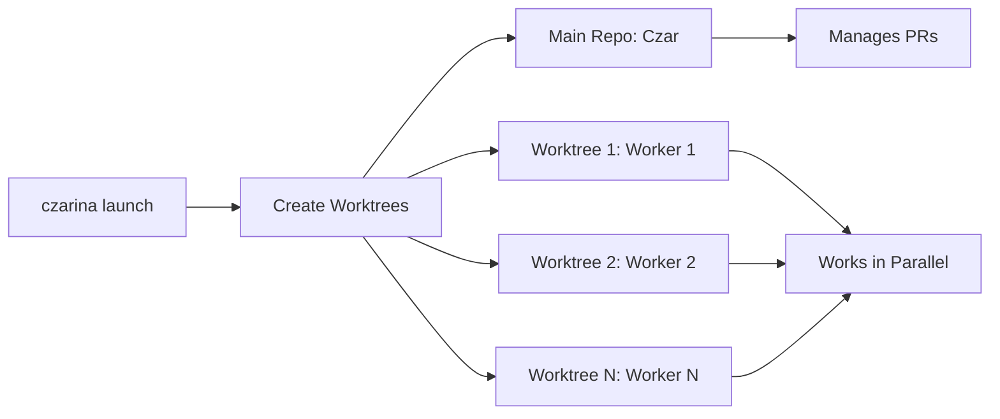

# Worker Isolation with Git Worktrees

## Overview

Czarina uses **git worktrees** to give each worker an isolated workspace on their own branch. This approach provides true parallelism - multiple agents can work simultaneously without conflicts. It works across **all AI coding assistants** (Claude Code, Cursor, Aider, Copilot, etc.) and requires minimal setup.

## How It Works



### The Flow

1. **Project Setup**: Run `czarina init` to create `.czarina/` orchestration directory
2. **Launch Workers**: Run `czarina launch` - automatically creates git worktrees for each worker
3. **Parallel Work**: Each worker has their own directory on their own branch
4. **Czar Coordination**: Czar (in main repo) monitors progress, manages PRs
5. **No Conflicts**: Workers never interfere with each other - separate workspaces
6. **Clean Merges**: Workers create PRs from their branches to main

## Benefits

### ✅ True Parallelism
- **Multiple agents work simultaneously** - no branch switching conflicts
- Each worker has completely isolated workspace
- No waiting for others to finish

### ✅ Universal Compatibility
- Works with **any AI coding assistant** (not just Claude Code)
- No special configuration per agent
- Same workflow for all tools

### ✅ Automatic Role Assignment
- Workers initialize with `.czarina/.worker-init <worker-id>`
- Workspace location = Identity
- Can't accidentally work on wrong task

### ✅ Clean Git History
- Each worker's commits isolated to their branch
- Easy to review changes per worker
- Simple to revert if needed

### ✅ Zero Conflicts
- Workers physically separated in different directories
- Impossible to interfere with each other
- Czar and workers never collide

## Setup

### 1. Initialize Czarina in Your Project

```bash
cd /path/to/your/project
czarina init
```

This creates:
- `.czarina/` directory with config and worker prompts
- Worker branches in git
- Gitignore entries for runtime files

### 2. Configure Czar SessionStart Hook (Optional)

**This hook is ONLY for the Czar (main repository).**
**Workers DON'T need hooks** - they use `.worker-init` instead.

Create `.claude/load-rules.sh` in your **main repository**:

```bash
#!/bin/bash
CLAUDE_DIR=".claude"
RULES_DIR=".kilocode/rules"

# Load Czar role
if [ -f "$CLAUDE_DIR/czar-rules.md" ]; then
    cat "$CLAUDE_DIR/czar-rules.md"
fi

# Load all development rules (shared with workers via worktrees)
if [ -d "$RULES_DIR" ]; then
    for rule_file in "$RULES_DIR"/*.md; do
        [ -f "$rule_file" ] && cat "$rule_file"
    done
fi
```

Make it executable:
```bash
chmod +x .claude/load-rules.sh
```

Configure `.claude/settings.local.json`:

```json
{
  "hooks": {
    "SessionStart": [
      {
        "matcher": "startup",
        "hooks": [
          {
            "type": "command",
            "command": "./.claude/load-rules.sh"
          }
        ]
      }
    ]
  }
}
```

### 3. Launch Workers

```bash
czarina launch
```

This automatically:
- Creates git worktrees in `.czarina/worktrees/`
- Launches tmux sessions with all workers
- Auto-starts daemon and dashboard
- No manual configuration needed!

## Worker Workflow

### For Orchestrator (Czar)

The orchestrator uses `czarina launch` which automatically creates worktrees and launches all workers in tmux. Each worker runs in their own worktree directory.

### For Individual Worker (Manual Access)

If you need to work directly in a worker's workspace:

1. **Navigate to worker's worktree**:
   ```bash
   cd .czarina/worktrees/backend-attention-service
   ```

2. **Load worker prompt**:
   ```bash
   ../../.worker-init backend-attention-service
   ```

   Or just read the prompt file:
   ```bash
   cat ../../workers/backend-attention-service.md
   ```

3. **Work on your task**: Follow the instructions in your worker prompt

4. **Commit regularly**:
   ```bash
   git add .
   git commit -m "Implement attention shaping service"
   git push
   ```

5. **Create PR when done**:
   ```bash
   gh pr create --title "feat: Attention Shaping Service" \
                --body "Implements requirements"
   ```

### Example: Worker in Worktree

```bash
$ cd .czarina/worktrees/backend-attention-service

$ git branch --show-current
feat/v0.1.0-backend-attention-service

$ ../../.worker-init backend-attention-service

╔════════════════════════════════════════════════════════════╗
║        Czarina Multi-Agent Orchestration Active           ║
╚════════════════════════════════════════════════════════════╝

🎯 Worker Identity: backend-attention-service
🌿 Branch: feat/v0.1.0-backend-attention-service
📁 Worktree: .czarina/worktrees/backend-attention-service
📄 Prompt: ./.czarina/workers/backend-attention-service.md

━━━━━━━━━━━━━━━━━━━━━━━━━━━━━━━━━━━━━━━━━━━━━━━━━━━━━━━━━━

# Backend Developer (Attention Service)

## Role
You are responsible for building the core AttentionShapingService...

[Full worker prompt loads]
```

## Czar Workflow

The Czar operates from the main repository (not a worktree):

```bash
$ cd /path/to/project  # Main repository

$ git branch --show-current
main

$ claude
# Claude Code starts and runs SessionStart hook (if configured)

╔════════════════════════════════════════════════════════════╗
║              Czar Rules Loaded                            ║
╚════════════════════════════════════════════════════════════╝

🌿 Branch: main
📁 Location: Main repository (not worktree)
📄 Loading: .claude/czar-rules.md + .kilocode/rules/*.md

━━━━━━━━━━━━━━━━━━━━━━━━━━━━━━━━━━━━━━━━━━━━━━━━━━━━━━━━━━

# Claude Czar Rules

You are **Claude Czar** - managing pull requests and infrastructure...

[Czar rules load]
```

The Czar:
- Monitors worker progress via `czarina dashboard`
- Reviews and merges PRs from worker branches
- Coordinates overall project progress
- Manages infrastructure and shared resources

## Directory Structure

### Main Repository (Czar's Workspace)
```
project/
├── .claude/                      # Czar-only hooks and rules
│   ├── settings.local.json       # SessionStart hook config (Czar only!)
│   ├── load-rules.sh             # Loads Czar role + dev rules
│   └── czar-rules.md             # Czar role definition
├── .kilocode/                    # Shared development rules
│   └── rules/                    # All workers get these via worktrees
│       ├── git-workflow.md
│       ├── code-standards.md
│       └── ...
├── .czarina/                     # Orchestration directory
│   ├── config.json               # Worker definitions
│   ├── workers/                  # Worker-specific prompts
│   │   ├── backend-attention-service.md
│   │   ├── sage-loop-integrator.md
│   │   └── ...
│   ├── .worker-init              # Worker initialization script
│   └── worktrees/                # Worker workspaces (auto-created)
│       ├── backend-attention-service/  # Worker 1's worktree
│       ├── sage-loop-integrator/       # Worker 2's worktree
│       └── ...
└── .git/
    └── worktrees/                # Git's worktree metadata
```

### Worker Worktree (Isolated Workspace)
```
.czarina/worktrees/backend-attention-service/
├── src/                          # Worker's code on their branch
├── .kilocode/                    # SHARED from main repo (git worktree magic!)
│   └── rules/                    # Same rules as Czar sees
├── .git                          # Points to main repo's git
└── [NO .claude/ directory!]      # Workers don't need hooks
```

**Key Points:**
- **Main repo**: Has `.claude/` with SessionStart hook (Czar only)
- **Worker worktrees**: Share `.kilocode/rules/` automatically, NO hooks needed
- **Workers initialize**: Via `.czarina/.worker-init <worker-id>` not hooks

## Troubleshooting

### Worktrees not created

**Check if worktrees exist**:
```bash
ls -la .czarina/worktrees/
# Should show directories for each worker
```

**If missing, manually create**:
```bash
czarina launch
# Automatically creates all worktrees
```

**Check git worktree list**:
```bash
git worktree list
# Shows all worktrees and their branches
```

### Worker can't find prompt

**Navigate to worktree first**:
```bash
cd .czarina/worktrees/backend-attention-service
```

**Use relative path to .worker-init**:
```bash
../../.worker-init backend-attention-service
```

**Or directly cat the prompt**:
```bash
cat ../../workers/backend-attention-service.md
```

### SessionStart hook error in worker worktree

**This is expected!** Workers don't need hooks.

If you see `.claude/load-rules.sh: No such file`:
- This is normal for worker worktrees
- Workers use `.worker-init` instead, not hooks
- Only the main repo (Czar) should have `.claude/` directory
- Remove any `.claude/` from worker worktrees

### Czar hook not loading

**Check you're in main repo, not worktree**:
```bash
pwd
# Should be /path/to/project, NOT /path/to/project/.czarina/worktrees/...
```

**Check hook file exists**:
```bash
ls -la .claude/load-rules.sh
# Should be executable
chmod +x .claude/load-rules.sh
```

**Test hook manually**:
```bash
./.claude/load-rules.sh
# Should load Czar rules and development rules
```

## Advanced Usage

### Adding New Workers

1. **Update `.czarina/config.json`**:
   ```json
   {
     "workers": [
       ...,
       {
         "id": "new-worker",
         "agent": "aider",
         "branch": "feat/new-worker",
         "description": "Does something cool"
       }
     ]
   }
   ```

2. **Create worker prompt**:
   ```bash
   cat > .czarina/workers/new-worker.md <<EOF
   # New Worker

   ## Role
   Your role description...

   ## Responsibilities
   - Task 1
   - Task 2
   EOF
   ```

3. **Launch (creates worktree automatically)**:
   ```bash
   czarina launch
   # Detects new worker and creates worktree
   ```

### Manually Creating Worktrees

If you need to create a worktree outside of `czarina launch`:

```bash
# Create branch if it doesn't exist
git checkout -b feat/new-worker

# Go back to main
git checkout main

# Create worktree
git worktree add .czarina/worktrees/new-worker feat/new-worker
```

### Cleaning Up Worktrees

```bash
# Remove a specific worktree
git worktree remove .czarina/worktrees/backend-attention-service

# Prune stale references
git worktree prune

# Or use czarina closeout (removes all worktrees)
czarina closeout
```

### Sharing Rules Across Workers

Place shared development rules in `.kilocode/rules/`:

```
.kilocode/
└── rules/
    ├── git-workflow.md
    ├── code-standards.md
    └── testing-requirements.md
```

All workers automatically see these via git worktree sharing - no duplication needed!

## Comparison to Other Approaches

### ❌ Branch Switching (Old Czarina Approach)
**Problem**: Multiple agents trying to `git checkout` different branches in same directory
- Race condition: all end up on same branch
- Can't work in parallel
- Last checkout wins

**Worktree Solution**: Each worker has isolated directory
- No race conditions
- True parallelism
- Each worker completely independent

### ❌ Manual Loading Every Time
**Tedious**: "You are backend-attention-service"
- Requires manual prompt each time
- Easy to forget or mistype
- Workers can accidentally load wrong role

**Worktree Approach**: Directory location = Identity
- Automatic role detection
- Can't accidentally be wrong worker
- One-time `.worker-init` call

### ❌ Separate Repository Clones
**Wasteful**: Clone repo 11 times for 11 workers
- 11x disk space usage
- 11x git history storage
- Hard to sync changes between workers

**Git Worktrees**: Efficient sharing
- Single `.git` directory
- Shared object storage
- Minimal overhead per worktree

## Best Practices

### ✅ DO

- **Use `czarina launch`** to create all worktrees automatically
- **Use `czarina closeout`** to clean up when done
- **Keep workers in their worktrees** during work
- **Put SessionStart hook ONLY in main repo** (for Czar)
- **Share rules via `.kilocode/rules/`** not duplication
- **Create PRs from worker branches** for review

### ❌ DON'T

- **Don't manually create worktrees** unless necessary (use `czarina launch`)
- **Don't put `.claude/` in worker worktrees** (they don't need hooks)
- **Don't push to main directly** (use PRs from worker branches)
- **Don't delete worktrees manually** (use `czarina closeout`)
- **Don't share branches** between workers (1 worker = 1 branch)

## Architecture Benefits Summary

✅ **True Parallelism**: Workers run simultaneously, no conflicts
✅ **Clean Separation**: Czar and workers physically isolated
✅ **Efficient Storage**: Worktrees share git objects, minimal overhead
✅ **Automatic Sharing**: `.kilocode/rules/` shared via worktree magic
✅ **Simple Management**: `czarina launch` and `czarina closeout` handle everything

## See Also

- [Automatic Branch Initialization](./AUTOMATIC_BRANCH_INITIALIZATION.md)
- [Init Branches Script](../czarina-core/init-embedded-branches.sh)
- [Launch Script v2](../czarina-core/launch-project-v2.sh)
- [Closeout Script](../czarina-core/closeout-project.sh)
